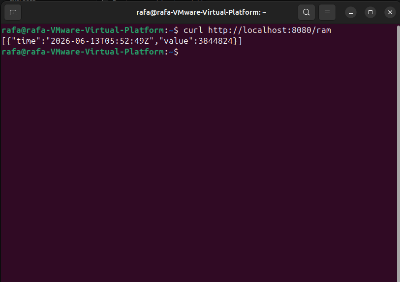
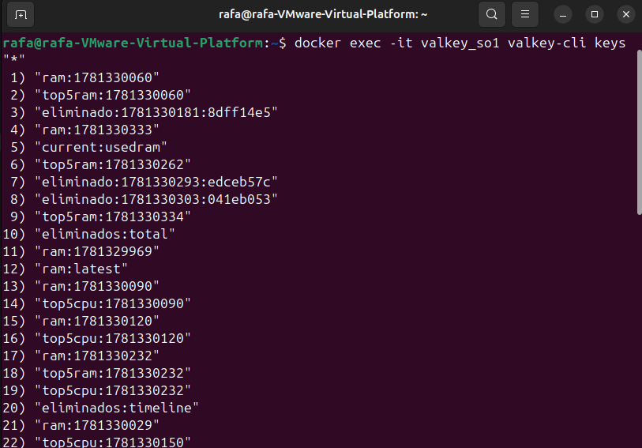
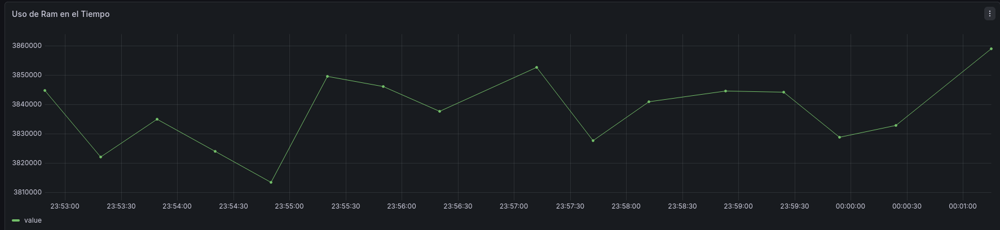
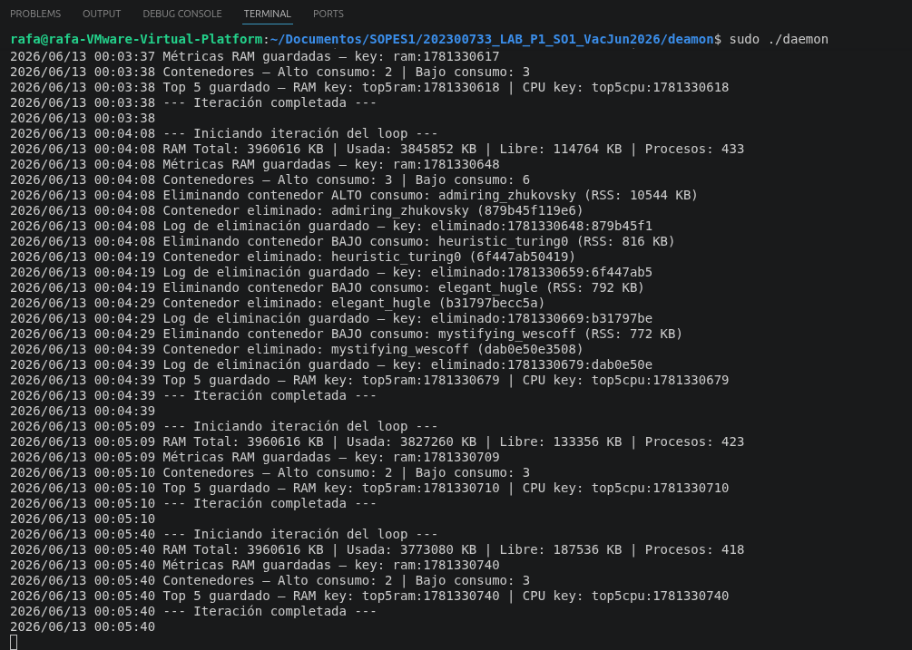

# Manual Técnico
## Proyecto 1: Sonda de Kernel en C y Daemon en Go para Telemetría de Contenedores

---

Universidad San Carlos de Guatemala

Angel Rafael Barrios González

202300733

Seccion P

Lab Sistemas Operativos 1

15/06/2026

---

## 1. Descripción General del Sistema

Este proyecto implementa un sistema integral de monitoreo y gestión autónoma de contenedores Docker sobre Linux. El sistema opera en dos niveles:

- **Nivel kernel (C):** Un módulo de kernel que accede directamente a las estructuras internas del sistema operativo para capturar métricas de procesos y memoria.
- **Nivel usuario (Go):** Un daemon que lee las métricas del kernel, toma decisiones de gestión de contenedores, persiste datos en Valkey y los visualiza en Grafana.

### Arquitectura general

```
┌─────────────────────────────────────────────────────┐
│                   DAEMON GO                          │
│  ┌──────────┐  ┌──────────┐  ┌───────────────────┐  │
│  │ Arranque │  │  Loop    │  │    Shutdown        │  │
│  │ Grafana  │  │  30 seg  │  │  Limpia cronjob   │  │
│  │ Cronjob  │  │  /proc   │  │  Descarga módulo  │  │
│  │ Kernel   │  │  Valkey  │  │                   │  │
│  └──────────┘  └──────────┘  └───────────────────┘  │
└──────────────────────┬──────────────────────────────┘
                       │
          ┌────────────┼────────────┐
          ▼            ▼            ▼
    ┌──────────┐ ┌──────────┐ ┌──────────┐
    │  MÓDULO  │ │  VALKEY  │ │ GRAFANA  │
    │ KERNEL C │ │ (Datos)  │ │(Dashboard│
    │  /proc   │ │          │ │          │
    └──────────┘ └──────────┘ └──────────┘
```

---

## 2. Estructura del Repositorio

```
202300733_LAB_P1_SO1_VacJun2026/
├── kernel/
│   ├── sysinfo.c          # Módulo de kernel en C
│   └── Makefile           # Script de compilación del módulo
├── cronjob/
│   ├── containers.sh      # Script bash que crea los contenedores
│   └── cronjob.go         # Lógica Go para instalar el cronjob
├── daemon/
│   ├── main.go            # Daemon principal en Go
│   ├── go.mod             # Definición del módulo Go
│   └── go.sum             # Checksums de dependencias
└── docker-compose.yml     # Definición de servicios Grafana + Valkey
```

---

## 3. Módulo de Kernel (sysinfo.c)

### 3.1 Descripción

El módulo de kernel es un sensor de bajo nivel que se inserta directamente en el kernel de Linux. Accede a las estructuras internas del sistema operativo para capturar métricas que no están disponibles para programas normales en el espacio de usuario.

### 3.2 Tecnologías utilizadas

- **Lenguaje:** C
- **API:** Linux Kernel API
- **Estructura principal:** `task_struct` — estructura interna del kernel que representa cada proceso
- **Interfaz de exposición:** Sistema de archivos `/proc`

### 3.3 Funcionamiento

Al cargarse el módulo crea el archivo `/proc/continfo_pr1_so1_202300733`. Cada vez que se lee este archivo, el módulo ejecuta la función `sysinfo_show()` que:

1. Obtiene métricas de RAM usando `si_meminfo()`
2. Itera sobre todos los procesos del sistema con `for_each_process(task)`
3. Por cada proceso extrae: PID, nombre, línea de comando, VSZ, RSS, %CPU, %Mem
4. Serializa toda la información en formato JSON

### 3.4 Métricas capturadas

| Campo | Descripción | Fuente en kernel |
|---|---|---|
| Totalram | Memoria RAM total en KB | `si.totalram << (PAGE_SHIFT - 10)` |
| Freeram | Memoria RAM libre en KB | `si.freeram << (PAGE_SHIFT - 10)` |
| Usedram | Memoria RAM en uso en KB | `Totalram - Freeram` |
| PID | Identificador del proceso | `task->pid` |
| Name | Nombre corto del proceso | `task->comm` |
| Cmdline | Línea de comando completa | `get_task_mm()` + `access_process_vm()` |
| VSZ | Tamaño memoria virtual en KB | `task->mm->total_vm << (PAGE_SHIFT - 10)` |
| RSS | Memoria física residente en KB | `get_mm_rss(task->mm) << (PAGE_SHIFT - 10)` |
| MemUsage | Porcentaje de memoria usado | `(RSS * 10000) / totalram` |
| CPUUsage | Porcentaje de CPU usado | `(utime + stime) * 10000 / jiffies` |

### 3.5 Formato de salida JSON

```json
{
  "Totalram": 3960628,
  "Freeram": 117104,
  "Usedram": 3843524,
  "Procs": 365,
  "Processes": [
    {
      "PID": 1,
      "Name": "systemd",
      "Cmdline": "/sbin/init splash",
      "VSZ": 23484,
      "RSS": 14076,
      "MemUsage": "0.35",
      "CPUUsage": "19.54"
    }
  ]
}
```


### 3.6 Compilación y carga

```bash
# Compilar
cd kernel
make

# Cargar
sudo insmod sysinfo.ko

# Verificar
lsmod | grep sysinfo
cat /proc/continfo_pr1_so1_202300733

# Descargar
sudo rmmod sysinfo
```


### 3.7 Makefile

```makefile
obj-m += sysinfo.o

all:
    make -C /lib/modules/$(shell uname -r)/build M=$(PWD) modules

clean:
    make -C /lib/modules/$(shell uname -r)/build M=$(PWD) clean
```

### 3.8 Problemas encontrados y soluciones

**Problema:** Caracteres especiales en `Cmdline` rompían el JSON (comillas y backslashes).

**Solución:** Se implementó una función de escape que recorre el string carácter por carácter y reemplaza `"` por `\"` y `\` por `\\` antes de escribirlos en el JSON.

---

## 4. Script de Contenedores (containers.sh)

### 4.1 Descripción

Script bash que crea 5 contenedores Docker de forma aleatoria entre 3 tipos distintos. Es ejecutado por el cronjob cada 2 minutos.

### 4.2 Tipos de contenedores

| Tipo | Imagen | Comando | Consumo |
|---|---|---|---|
| Alto RAM | roldyoran/go-client | `docker run -d roldyoran/go-client` | Alto consumo de memoria |
| Alto CPU | alpine | `docker run -d alpine sh -c "while true; do echo '2^20' \| bc > /dev/null; sleep 2; done"` | Alto consumo de CPU |
| Bajo | alpine | `docker run -d alpine sleep 240` | Consumo mínimo |

### 4.3 Lógica de selección aleatoria

```bash
for i in {1..5}; do
  indice=$((RANDOM % 3))
  eval "${comandos[$indice]}"
done
```

La variable `$RANDOM` de bash genera un número entre 0 y 32767. Con `% 3` se obtiene un índice entre 0 y 2 que selecciona aleatoriamente uno de los 3 tipos.

---

## 5. Daemon en Go (main.go)

### 5.1 Descripción

El daemon es el componente central del sistema. Es un servicio que corre indefinidamente en segundo plano y orquesta todos los demás componentes.

### 5.2 Dependencias

| Paquete | Versión | Uso |
|---|---|---|
| github.com/redis/go-redis/v9 | v9.5.4 | Cliente para comunicarse con Valkey |
| Paquetes estándar de Go | — | JSON, HTTP, exec, signals |

### 5.3 Flujo de ejecución

```
main()
  │
  ├── levantarInfraestructura()   → docker compose up -d
  ├── conectarValkey()             → redis.NewClient localhost:6379
  ├── instalarCronjob()            → crontab */2 * * * *
  ├── cargarModuloKernel()         → sudo insmod sysinfo.ko
  ├── iniciarHTTPServer()          → puerto 8080 para Grafana
  │
  └── Loop goroutine cada 30 seg
        │
        ├── loopPrincipal()
        │     ├── Leer /proc/continfo_pr1_so1_202300733
        │     ├── Deserializar JSON → struct ProcInfo
        │     ├── guardarMetricasRAM()
        │     ├── obtenerContenedores()
        │     ├── clasificarContenedores()
        │     ├── gestionarContenedores()
        │     └── guardarTop5()
        │
  └── Señal SIGINT/SIGTERM
        └── shutdown()
              ├── Eliminar cronjob
              └── sudo rmmod sysinfo
```

### 5.4 Estructuras de datos

```go
// Información completa leída de /proc
type ProcInfo struct {
    Totalram  uint64    `json:"Totalram"`
    Freeram   uint64    `json:"Freeram"`
    Usedram   uint64    `json:"Usedram"`
    Procs     int       `json:"Procs"`
    Processes []Process `json:"Processes"`
}

// Datos de cada proceso
type Process struct {
    PID      int    `json:"PID"`
    Name     string `json:"Name"`
    Cmdline  string `json:"Cmdline"`
    VSZ      uint64 `json:"VSZ"`
    RSS      uint64 `json:"RSS"`
    MemUsage string `json:"MemUsage"`
    CPUUsage string `json:"CPUUsage"`
}

// Contenedor Docker enriquecido con métricas
type ContainerInfo struct {
    ID       string
    Name     string
    Image    string
    Tipo     string  // "alto" o "bajo"
    RSS      uint64
    VSZ      uint64
    MemUsage float64
    CPUUsage float64
    PID      int
}
```

### 5.5 Lógica de clasificación de contenedores

Un contenedor se clasifica como **alto consumo** si:
- Su imagen contiene `go-client`
- Su comando contiene `bc` (cálculo matemático intensivo)

Cualquier otro contenedor se clasifica como **bajo consumo**.

### 5.6 Lógica de gestión y eliminación

```
1. Obtener lista de contenedores activos (docker ps)
2. Excluir grafana_so1 y valkey_so1 (nunca se eliminan)
3. Clasificar cada contenedor como alto o bajo consumo
4. Ordenar altos por RSS descendente
5. Ordenar bajos por RSS descendente
6. Si hay más de 2 altos → eliminar los excedentes (mayor consumo primero)
7. Si hay más de 3 bajos → eliminar los excedentes (mayor consumo primero)
8. Para cada eliminado: docker stop + docker rm + log en Valkey
```

### 5.7 Endpoint HTTP para Grafana

El daemon expone un servidor HTTP en el puerto 8080 con estos endpoints:

| Endpoint | Descripción | Formato |
|---|---|---|
| `/ram` | Histórico de uso de RAM | Array de `{time, value}` |
| `/eliminados` | Historial de eliminaciones | Array de `{time, count}` |
| `/top5ram` | Top 5 contenedores por RAM | Array de `{name, value}` |
| `/top5cpu` | Top 5 contenedores por CPU | Array de `{name, value}` |



---

## 6. Persistencia en Valkey

### 6.1 Descripción

Valkey es una base de datos key-value compatible con Redis donde el daemon guarda todos los logs y métricas para su posterior visualización en Grafana.

### 6.2 Estructura de keys

| Key | Tipo | Contenido | Expiración |
|---|---|---|---|
| `ram:{timestamp}` | Hash | totalram, freeram, usedram, procs | 24 horas |
| `ram:latest` | String | Nombre de la key del último snapshot | 24 horas |
| `ram:timeline` | Sorted Set | Lista ordenada de keys de RAM | — |
| `current:totalram` | String | Valor actual de RAM total | 24 horas |
| `current:freeram` | String | Valor actual de RAM libre | 24 horas |
| `current:usedram` | String | Valor actual de RAM usada | 24 horas |
| `ts:usedram` | Sorted Set | Serie temporal de RAM usada | 24 horas |
| `ts:freeram` | Sorted Set | Serie temporal de RAM libre | 24 horas |
| `ts:eliminados` | Sorted Set | Serie temporal de eliminaciones | 24 horas |
| `eliminado:{ts}:{id}` | Hash | Datos completos del contenedor eliminado | 24 horas |
| `eliminados:timeline` | Sorted Set | Lista ordenada de eliminaciones | — |
| `eliminados:total` | String | Contador total de eliminados | — |
| `top5ram:latest` | String | Key del último top 5 por RAM | 24 horas |
| `top5cpu:latest` | String | Key del último top 5 por CPU | 24 horas |



---

## 7. Docker Compose (docker-compose.yml)

### 7.1 Descripción

Define y levanta los servicios de Grafana y Valkey en una red compartida para que puedan comunicarse entre sí y con el daemon.

### 7.2 Configuración

```yaml
services:
  valkey:
    image: valkey/valkey:latest
    container_name: valkey_so1
    ports:
      - "6379:6379"
    networks:
      - monitoring_net

  grafana:
    image: grafana/grafana:latest
    container_name: grafana_so1
    ports:
      - "3000:3000"
    environment:
      - GF_SECURITY_ADMIN_USER=admin
      - GF_SECURITY_ADMIN_PASSWORD=admin
    networks:
      - monitoring_net

networks:
  monitoring_net:
    driver: bridge
```

---

## 8. Dashboard de Grafana

### 8.1 Plugins instalados

| Plugin | Uso |
|---|---|
| redis-datasource | Conectar Grafana con Valkey para los cards de RAM |
| yesoreyeram-infinity-datasource | Leer datos JSON del servidor HTTP del daemon |

### 8.2 Datasources configurados

| Nombre | Tipo | URL/Dirección |
|---|---|---|
| redis-datasource | Redis | `valkey_so1:6379` |
| Infinity | Infinity | — (lee del HTTP server del daemon) |

### 8.3 Paneles del dashboard

| Panel | Tipo | Datasource | Query |
|---|---|---|---|
| Total RAM | Stat | Redis | GET `current:totalram` |
| RAM Usada | Stat | Redis | GET `current:usedram` |
| Free RAM | Stat | Redis | GET `current:freeram` |
| Total Eliminados | Stat | Redis | GET `eliminados:total` |
| Uso de RAM en el Tiempo | Time Series | Infinity | `http://172.17.0.1:8080/ram` |
| Contenedores Eliminados | Bar Chart | Infinity | `http://172.17.0.1:8080/eliminados` |
| Top 5 por RAM | Pie Chart | Infinity | `http://172.17.0.1:8080/top5ram` |
| Top 5 por CPU | Pie Chart | Infinity | `http://172.17.0.1:8080/top5cpu` |




---

## 9. Guía de Instalación desde Cero

### Requisitos del sistema

- Ubuntu 24.04 LTS
- Mínimo 4 GB RAM
- Mínimo 30 GB disco
- Conexión a internet

### Paso 1 — Instalar dependencias

```bash
sudo apt update && sudo apt upgrade -y
sudo apt install -y build-essential linux-headers-$(uname -r) gcc make git curl wget

# Instalar Go
wget https://go.dev/dl/go1.22.0.linux-amd64.tar.gz
sudo tar -C /usr/local -xzf go1.22.0.linux-amd64.tar.gz
echo 'export PATH=$PATH:/usr/local/go/bin' >> ~/.bashrc
source ~/.bashrc

# Instalar Docker
sudo apt install -y ca-certificates curl gnupg
sudo install -m 0755 -d /etc/apt/keyrings
curl -fsSL https://download.docker.com/linux/ubuntu/gpg | sudo gpg --dearmor -o /etc/apt/keyrings/docker.gpg
sudo chmod a+r /etc/apt/keyrings/docker.gpg
echo "deb [arch=$(dpkg --print-architecture) signed-by=/etc/apt/keyrings/docker.gpg] https://download.docker.com/linux/ubuntu $(. /etc/os-release && echo "$VERSION_CODENAME") stable" | sudo tee /etc/apt/sources.list.d/docker.list > /dev/null
sudo apt update
sudo apt install -y docker-ce docker-ce-cli containerd.io docker-buildx-plugin docker-compose-plugin
sudo usermod -aG docker $USER
newgrp docker
```

### Paso 2 — Clonar el repositorio

```bash
git clone https://github.com/tu-usuario/202300733_LAB_P1_SO1_VacJun2026.git
cd 202300733_LAB_P1_SO1_VacJun2026
```

### Paso 3 — Compilar el módulo de kernel

```bash
cd kernel
make
cd ..
```

### Paso 4 — Preparar el daemon

```bash
cd daemon
go mod tidy
go build -o daemon main.go
cd ..
```

### Paso 5 — Correr el sistema

```bash
cd daemon
sudo ./daemon
```

---

## 10. Errores Conocidos y Soluciones

### Error: JSON inválido en /proc

**Causa:** Algunos procesos tienen caracteres especiales (`"` o `\`) en su línea de comando que rompían el formato JSON.

**Solución:** Se implementó una función de escape en `sysinfo.c` que recorre carácter por carácter el cmdline y escapa los caracteres problemáticos antes de escribirlos.

### Error: go mod tidy actualiza a Go 1.24

**Causa:** La versión más reciente de `go-redis` requería Go 1.24 pero el sistema tiene Go 1.22.

**Solución:** Se usó una versión anterior compatible: `go get github.com/redis/go-redis/v9@v9.5.4` y se configuró `go mod edit -toolchain=none`.

### Error: Timestamps en Grafana mostrando año 1969

**Causa:** El plugin Infinity no interpretaba correctamente los timestamps Unix como fechas de 2026.

**Solución:** Se cambió el parser a UQL con campo vacío y se modificó el endpoint `/ram` para devolver fechas en formato RFC3339 (`2026-06-10T05:58:14Z`).

### Error: Cronjob duplicado creando 10 contenedores

**Causa:** El cronjob fue instalado dos veces — una manualmente durante las pruebas y otra por el daemon.

**Solución:** Se usó `crontab -r` para limpiar el crontab y se mejoró el comando de instalación para que verifique duplicados con `grep -v containers.sh` antes de agregar la nueva entrada.

### Error: Módulo de kernel no compila

**Causa:** Los headers del kernel no estaban instalados correctamente.

**Solución:** `sudo apt install -y linux-headers-$(uname -r)`

---

## 11. Evidencia de Funcionamiento



