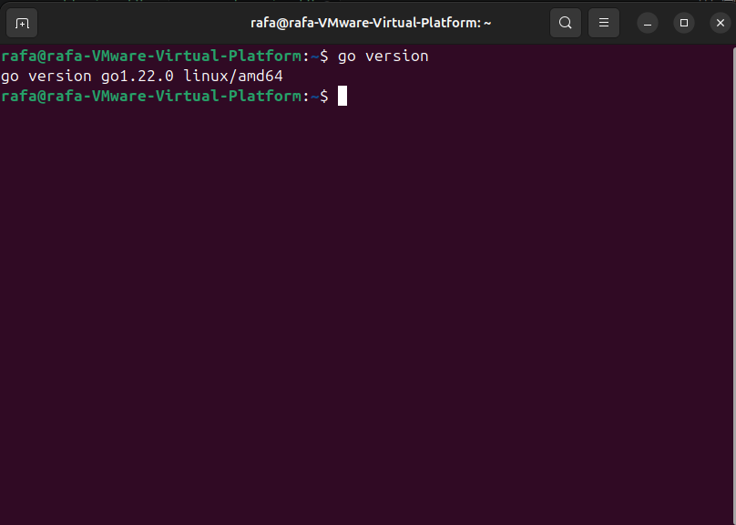
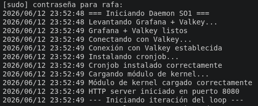
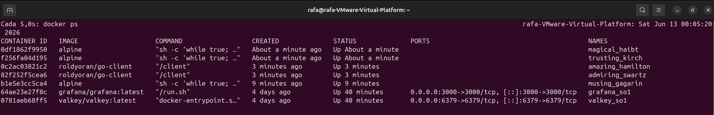
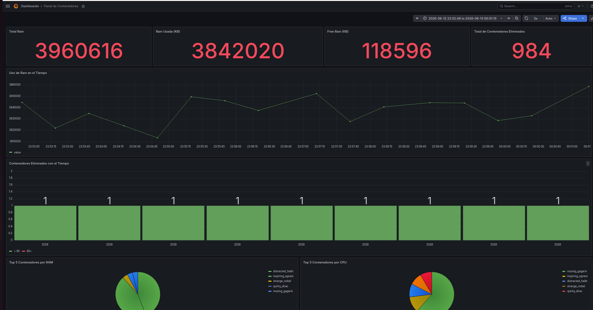
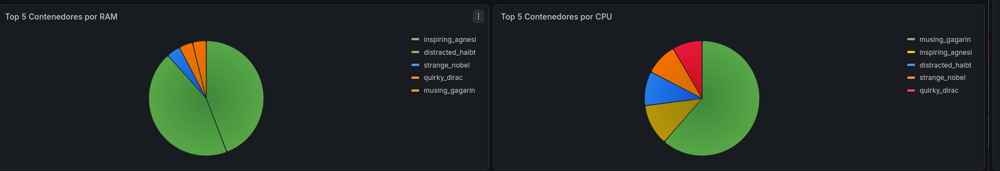

# Manual de Usuario
## Proyecto 1: Sonda de Kernel y Daemon para Telemetría de Contenedores

---

Universidad San Carlos de Guatemala

Angel Rafael Barrios González

202300733

Seccion P

Lab Sistemas Operativos 1

15/06/2026

---

## ¿Qué es este programa?

Este proyecto es un sistema que vigila de manera automática los programas (contenedores) que están corriendo en tu computadora. Funciona como un guardián que cada 30 segundos revisa cuánta memoria y CPU están usando los contenedores, elimina los que están de más, y muestra todo eso en una pantalla visual llamada Grafana.

En términos simples:
- Cada 2 minutos se crean 5 contenedores nuevos de prueba de forma aleatoria
- El sistema revisa y mantiene siempre exactamente 2 contenedores de alto consumo y 3 de bajo consumo
- Todo lo que ocurre se guarda y se puede ver en tiempo real en el dashboard de Grafana

---

## Lo que necesitas antes de empezar

Antes de correr el programa, tu máquina debe tener instaladas las siguientes herramientas. Si seguiste el proceso de instalación, ya las tienes todas.

| Herramienta | Para qué sirve |
|---|---|
| Ubuntu 24.04 | El sistema operativo donde corre todo |
| Go 1.22 | Para correr el programa principal |
| Docker | Para manejar los contenedores |
| Docker Compose | Para levantar Grafana y Valkey juntos |
| GCC y Make | Para compilar el módulo del kernel |
| Linux Headers | Para que el módulo del kernel funcione |

---

## Cómo instalar todo desde cero

Abre una terminal en Ubuntu y ejecuta estos comandos uno por uno:

### Paso 1 — Actualizar el sistema

```bash
sudo apt update && sudo apt upgrade -y
```

### Paso 2 — Instalar herramientas de compilación

```bash
sudo apt install -y build-essential linux-headers-$(uname -r) gcc make git curl wget
```

### Paso 3 — Instalar Go

```bash
wget https://go.dev/dl/go1.22.0.linux-amd64.tar.gz
sudo tar -C /usr/local -xzf go1.22.0.linux-amd64.tar.gz
echo 'export PATH=$PATH:/usr/local/go/bin' >> ~/.bashrc
source ~/.bashrc
```

Verifica que quedó bien instalado:

```bash
go version
```

Deberías ver algo como esto:



### Paso 4 — Instalar Docker

```bash
sudo apt install -y ca-certificates curl gnupg
sudo install -m 0755 -d /etc/apt/keyrings
curl -fsSL https://download.docker.com/linux/ubuntu/gpg | sudo gpg --dearmor -o /etc/apt/keyrings/docker.gpg
sudo chmod a+r /etc/apt/keyrings/docker.gpg
echo \
  "deb [arch=$(dpkg --print-architecture) signed-by=/etc/apt/keyrings/docker.gpg] https://download.docker.com/linux/ubuntu \
  $(. /etc/os-release && echo "$VERSION_CODENAME") stable" | \
  sudo tee /etc/apt/sources.list.d/docker.list > /dev/null
sudo apt update
sudo apt install -y docker-ce docker-ce-cli containerd.io docker-buildx-plugin docker-compose-plugin
sudo usermod -aG docker $USER
newgrp docker
```

Verifica que Docker quedó instalado:

```bash
docker --version
docker compose version
```


---

## Cómo obtener el proyecto

```bash
git clone https://github.com/tu-usuario/202300733_LAB_P1_SO1_VacJun2026.git
cd 202300733_LAB_P1_SO1_VacJun2026
```

La estructura del proyecto se ve así:

```
202300733_LAB_P1_SO1_VacJun2026/
├── kernel/
│   ├── sysinfo.c
│   └── Makefile
├── cronjob/
│   ├── containers.sh
│   └── cronjob.go
├── daemon/
│   ├── main.go
│   ├── go.mod
│   └── go.sum
└── docker-compose.yml
```

---

## Cómo compilar el módulo del kernel

El módulo del kernel es la parte que lee la información del sistema. Solo necesitas compilarlo una vez.

```bash
cd kernel
make
```

Cuando funciona bien, verás que se crea un archivo llamado `sysinfo.ko`:


---

## Cómo correr el programa

Una vez compilado el módulo, todo lo demás lo hace automáticamente el programa principal (el daemon). Solo necesitas estos pasos:

### Paso 1 — Ir a la carpeta del daemon

```bash
cd ~/202300733_LAB_P1_SO1_VacJun2026/daemon
```

### Paso 2 — Compilar el daemon (solo si es la primera vez o si hubo cambios)

```bash
go build -o daemon main.go
```

### Paso 3 — Ejecutar el daemon

```bash
sudo ./daemon
```

Cuando el programa arranca correctamente, verás mensajes como estos en la terminal:

```
=== Iniciando Daemon SO1 ===
Levantando Grafana + Valkey...
Grafana + Valkey listos
Conectando con Valkey...
Conexión con Valkey establecida
Instalando cronjob...
Cronjob instalado correctamente
Cargando módulo de kernel...
Módulo de kernel cargado correctamente
--- Iniciando iteración del loop ---
RAM Total: XXXX KB | Usada: XXXX KB | Libre: XXXX KB
--- Iteración completada ---
```



---

## Cómo ver los contenedores corriendo

Mientras el daemon está corriendo, abre otra terminal y escribe:

```bash
docker ps
```

Deberías ver exactamente 5 contenedores de prueba más los de Grafana y Valkey:


---

## Cómo verificar que el módulo del kernel funciona

Para ver los datos que está leyendo el módulo del kernel, abre otra terminal y escribe:

```bash
cat /proc/continfo_pr1_so1_202300733
```

Verás un listado de todos los procesos con su PID, nombre, memoria y CPU:

> **[CAPTURA 6 — Salida del comando cat /proc/continfo_pr1_so1_202300733 mostrando el JSON con los procesos]**

El inicio del archivo se ve así:

```json
{
  "Totalram": 3960628,
  "Freeram": 117104,
  "Usedram": 3843524,
  "Procs": 365,
  "Processes": [
    {
      "PID": 1,
      "Name": "systemd",
      "Cmdline": "/sbin/init splash",
      "VSZ": 23484,
      "RSS": 14076,
      "MemUsage": "0.35",
      "CPUUsage": "19.54"
    },
    ...
  ]
}
```

---

## Cómo ver el dashboard de Grafana

Con el daemon corriendo, abre Firefox en la máquina virtual y ve a esta dirección:

```
http://localhost:3000
```

Ingresa con estas credenciales:
- **Usuario:** admin
- **Contraseña:** admin


Una vez dentro, ve a **Dashboards** y abre el dashboard llamado **"Panel de Contenedores"**. Verás algo como esto:



### ¿Qué significa cada panel?

**Total RAM** — La memoria total de tu máquina en KB

**RAM Usada** — Cuánta memoria está siendo usada en este momento

**Free RAM** — Cuánta memoria está libre

**Total Contenedores Eliminados** — Cuántos contenedores ha eliminado el sistema desde que arrancó

**Uso de RAM en el Tiempo** — Una gráfica que muestra cómo ha variado el uso de memoria a lo largo del tiempo

**Contenedores Eliminados en el Tiempo** — Muestra en qué momentos se eliminaron contenedores

**Top 5 por RAM** — Los 5 contenedores que más memoria han consumido

**Top 5 por CPU** — Los 5 contenedores que más CPU han consumido



---

## Cómo detener el programa correctamente

Para detener el daemon, ve a la terminal donde está corriendo y presiona:

```
Ctrl + C
```

El sistema se cerrará de manera ordenada y verás estos mensajes:

```
Señal recibida: interrupt — iniciando shutdown...
Eliminando cronjob...
Cronjob eliminado
Descargando módulo de kernel...
Módulo descargado
=== Daemon detenido correctamente ===
```

> **[CAPTURA 10 — Terminal mostrando el proceso de cierre limpio del daemon]**

Después de esto puedes verificar que todo quedó limpio:

```bash
crontab -l        # No debe mostrar nada
lsmod | grep sysinfo   # No debe mostrar nada
```

---

## Problemas comunes y cómo solucionarlos

### El daemon dice "Error conectando con Valkey"

Esto pasa cuando Grafana y Valkey no están corriendo. Solución:

```bash
cd ~/202300733_LAB_P1_SO1_VacJun2026
docker compose up -d
```

Luego vuelve a correr el daemon.

### El módulo del kernel no compila

Verifica que tienes los headers del kernel instalados:

```bash
sudo apt install -y linux-headers-$(uname -r)
```

### El comando docker no funciona sin sudo

```bash
sudo usermod -aG docker $USER
newgrp docker
```

### Grafana no abre en el navegador

Verifica que el contenedor esté corriendo:

```bash
docker ps | grep grafana
```

Si no aparece, levanta los servicios:

```bash
docker compose up -d
```

---

## Resumen de comandos importantes

| Acción | Comando |
|---|---|
| Compilar módulo kernel | `cd kernel && make` |
| Compilar daemon | `cd daemon && go build -o daemon main.go` |
| Correr el sistema | `sudo ./daemon` |
| Ver contenedores | `docker ps` |
| Ver datos del kernel | `cat /proc/continfo_pr1_so1_202300733` |
| Ver Grafana | Abrir `http://localhost:3000` en el navegador |
| Detener el sistema | `Ctrl + C` en la terminal del daemon |
